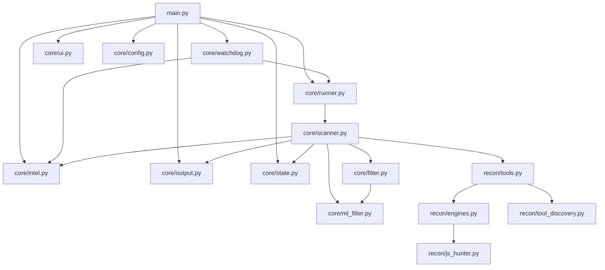

# Hunt3r v1.0-EXCALIBUR — Diagrama de Arquitetura

## 1) Arquitetura consolidada (Slim Core)

## 2) Pipeline de execução

## 3) Mapa de arquivos

| Arquivo | Linhas | Responsabilidade |
|---------|--------|------------------|
| `main.py` | ~293 | CLI, roteamento de modos |
| `core/scanner.py` | ~771 | MissionRunner + ProOrchestrator |
| `core/ui.py` | ~805 | UI tática fullscreen (Rich Live) |
| `core/watchdog.py` | ~354 | Loop 24/7 adaptativo |
| `core/config.py` | ~229 | Configuração centralizada |
| `core/filter.py` | ~112 | FalsePositiveKiller (7 camadas) |
| `core/ml_filter.py` | ~225 | Filtro ML (LightGBM) |
| `core/notifier.py` | ~358 | Telegram/Discord + dedup temporal |
| `core/ai.py` | ~251 | AIClient + IntelMiner (OpenRouter) |
| `core/bounty_scorer.py` | ~269 | Scoring de programas |
| `core/reporter.py` | ~240 | Relatórios Markdown |
| `core/export.py` | ~185 | CSV/XLSX/XML + dry-run |
| `core/storage.py` | ~184 | ReconDiff + CheckpointManager |
| `core/updater.py` | ~219 | PDTM + nuclei-templates |
| `recon/engines.py` | ~266 | Wrappers de ferramentas |
| `recon/js_hunter.py` | ~160 | Extração de segredos JS |
| `recon/platforms.py` | ~243 | APIs H1/BC/IT |
| `recon/tech_detector.py` | ~307 | Detecção de tecnologias |

## 4) Facades unificadas

| Facade | Consolida | Exporta |
|--------|-----------|---------|
| `core/runner.py` | scanner.py | `MissionRunner`, `ProOrchestrator` |
| `core/intel.py` | ai.py + bounty_scorer.py | `AIClient`, `IntelMiner`, `score_program` |
| `core/state.py` | storage.py | `ReconDiff`, `CheckpointManager`, `resume_mission` |
| `core/output.py` | notifier + reporter + export | `NotificationDispatcher`, `BugBountyReporter`, `ExportFormatter` |
| `recon/tools.py` | engines.py + tool_discovery.py | `find_tool`, `run_subfinder`, `run_nuclei`, etc. |
