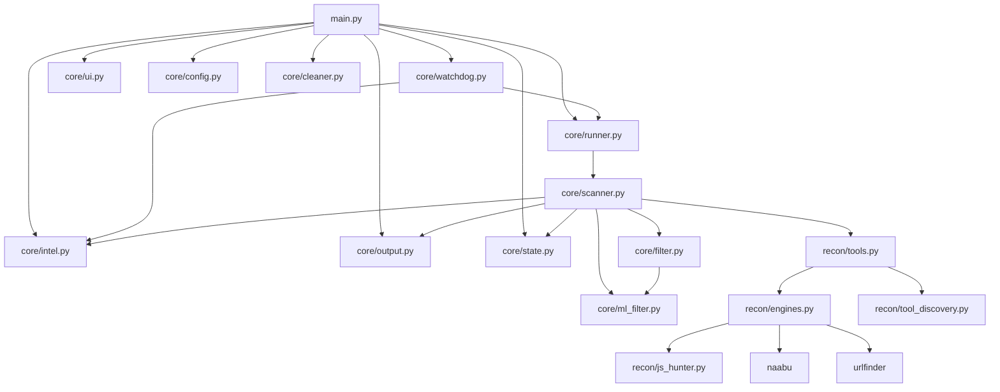
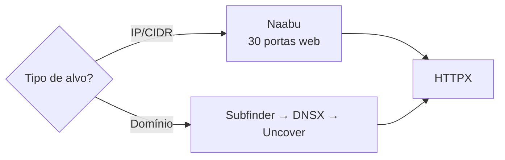

# Hunt3r v1.0-EXCALIBUR — Diagrama de Arquitetura

## 1) Arquitetura consolidada (Slim Core)

## 2) Pipeline de execução

```mermaid
graph LR
    W[Watchdog] --> D[Diff Engine]
    D --> SF[Subfinder]
    SF --> DN[DNSX]
    DN --> UN[Uncover]
    UN --> NB[Naabu\nport scan]
    NB --> HX[HTTPX]
    HX --> KT[Katana\n-js-crawl depth 3]
    KT --> UF[URLFinder\nhist URLs]
    UF --> MG[Merge\ndedup URLs]
    MG --> JS[JS Hunter]
    JS --> NU[Nuclei M/H/C]
    NU --> FP[FP Filter 7+ML]
    FP --> AI[Validação IA score≥60]
    AI --> NT[Telegram/Discord]
    NT --> RP[Relatório .md]
```

## 3) Mapa de arquivos

| Arquivo | Responsabilidade |
|---------|------------------|
| `main.py` | CLI, roteamento de modos |
| `core/scanner.py` | MissionRunner + ProOrchestrator |
| `core/ui.py` | UI tática fullscreen (Rich Live, 9 tools, height=15) |
| `core/watchdog.py` | Loop 1-2h adaptativo + platform tagging |
| `core/config.py` | Configuração centralizada |
| `core/filter.py` | FalsePositiveKiller (7 camadas) |
| `core/ml_filter.py` | Filtro ML (LightGBM) |
| `core/notifier.py` | Telegram vulns M/H/C; Discord stats/heartbeat |
| `core/ai.py` | AIClient + IntelMiner (OpenRouter) |
| `core/bounty_scorer.py` | Scoring 4 sinais (wildcard/breadth/quality/platform) |
| `core/reporter.py` | Relatórios Markdown com plataforma correta |
| `core/export.py` | CSV/XLSX/XML/PDF com nome do alvo |
| `core/cleaner.py` | --clean: purge/update/health/sync/testes |
| `core/storage.py` | ReconDiff + CheckpointManager |
| `core/updater.py` | PDTM + nuclei-templates |
| `recon/engines.py` | Wrappers de ferramentas + run_naabu + run_urlfinder |
| `recon/js_hunter.py` | Extração de segredos JS com campo severity |
| `recon/platforms.py` | H1 API (platform='h1') + alvos.txt (platform='custom') |
| `recon/tech_detector.py` | Detecção de tecnologias para tags Nuclei |

## 4) Facades unificadas

| Facade | Consolida | Exporta |
|--------|-----------|---------|
| `core/runner.py` | scanner.py | `MissionRunner`, `ProOrchestrator` |
| `core/intel.py` | ai.py + bounty_scorer.py | `AIClient`, `IntelMiner`, `score_program`, `score_watchdog_target` |
| `core/state.py` | storage.py | `ReconDiff`, `CheckpointManager`, `resume_mission` |
| `core/output.py` | notifier + reporter + export | `NotificationDispatcher`, `BugBountyReporter`, `ExportFormatter` |
| `recon/tools.py` | engines.py + tool_discovery.py | `find_tool`, `run_subfinder`, `run_naabu`, `run_urlfinder`, `run_nuclei`, etc. |

## 5) Routing de notificações

| Finding | Destino |
|---------|---------|
| Nuclei Medium/High/Critical | Telegram |
| JS Secret CRITICAL/HIGH/MEDIUM | Telegram |
| JS Secret LOW | Descartado |
| Nuclei Low/Info | Descartado |
| Scan statistics (sub/host/ports/ep/hist/sec/vuln) | Discord embed |
| Watchdog heartbeat / rain-check | Discord |

## 6) Modo IP vs Domínio

Portas cobertas pelo Naabu: `80, 443, 3000, 3001, 4000, 4200, 4443, 5000, 5001, 5443, 7070, 7443, 8000-8090, 8181, 8443, 8888, 8889, 9000, 9001, 9090, 9200, 9443, 10000`
