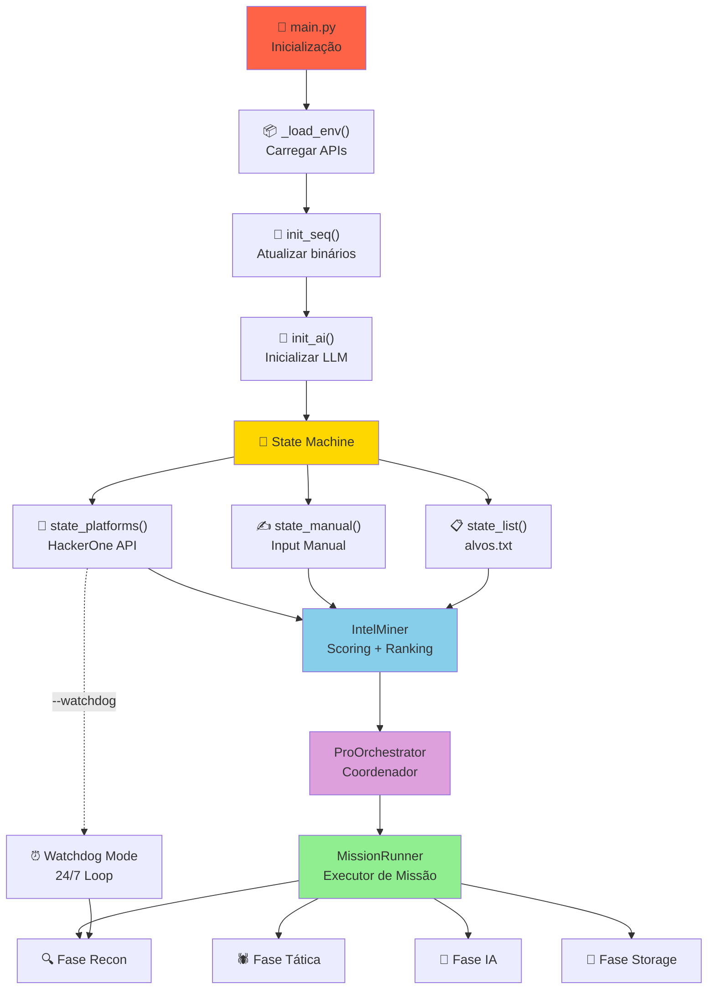
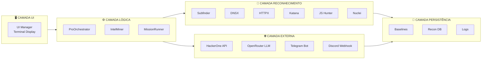
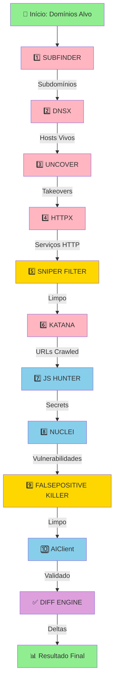
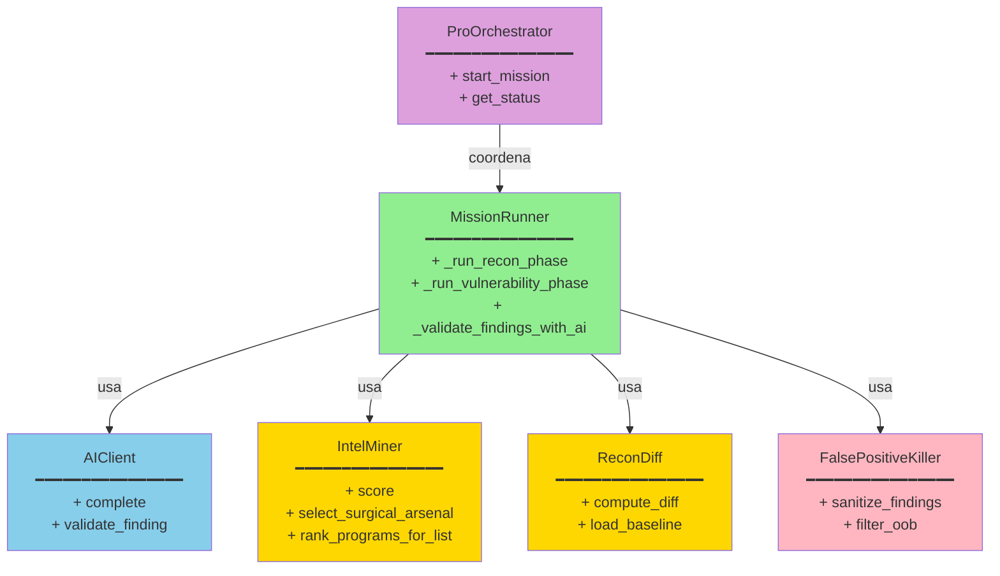
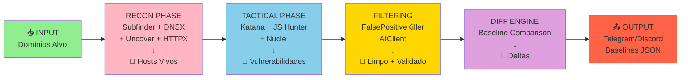
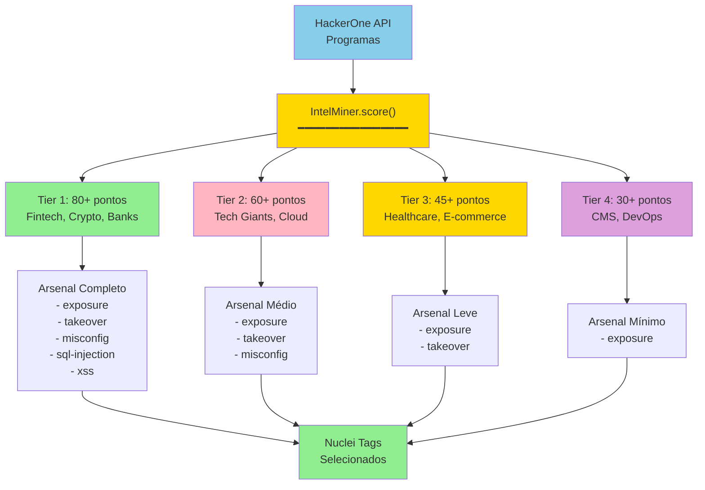
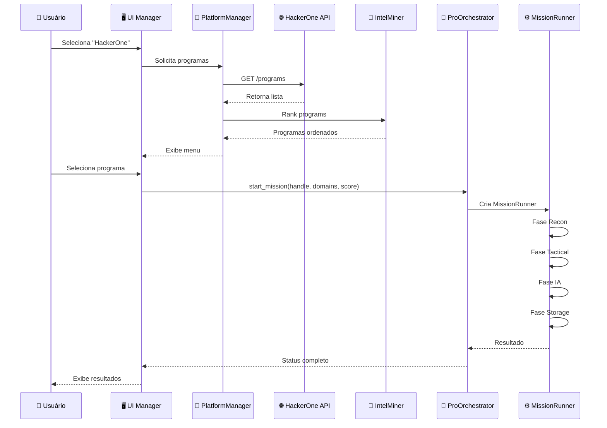
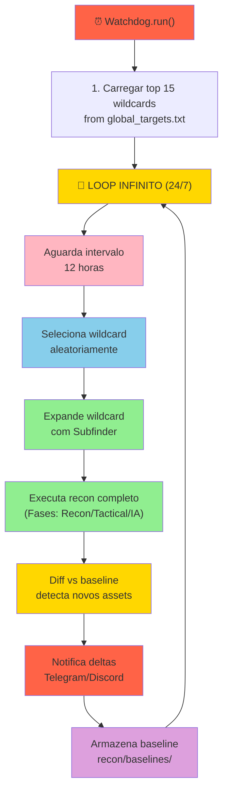

# HUNT3R v2.2 - Diagramas de Arquitetura

## 1. Fluxo Principal da Aplicação

## 2. Arquitetura em Camadas

## 3. Ciclo de Recon - Fase por Fase

## 4. Estrutura de Classes - Orquestração

## 5. Pipeline de Dados

## 6. Integrações Externas

```mermaid
graph TB
    HR["HUNT3R<br/>Core"]
    
    HR -->|Requisição| H1["HackerOne API<br/>GET /programs<br/>GET /scopes"]
    HR -->|Requisição| OR["OpenRouter API<br/>POST /chat/completions"]
    HR -->|Requisição| TG["Telegram Bot<br/>sendMessage"]
    HR -->|Requisição| DC["Discord Webhook<br/>POST webhook"]
    
    HR -->|Executa| SF["🔨 Subfinder<br/>Go Binary"]
    HR -->|Executa| DNS["🔨 DNSX<br/>Go Binary"]
    HR -->|Executa| HP["🔨 HTTPX<br/>Go Binary"]
    HR -->|Executa| UC["🔨 Uncover<br/>Go Binary"]
    HR -->|Executa| KT["🔨 Katana<br/>Go Binary"]
    HR -->|Executa| NUC["🔨 Nuclei<br/>Go Binary"]
    
    HR -->|Git Clone| PT["PayloadsAllTheThings<br/>Custom Payloads"]
    HR -->|Git Update| NUT["Nuclei Templates<br/>Community Templates"]
    
    style HR fill:#FFD700
    style H1 fill:#87CEEB
    style OR fill:#87CEEB
    style TG fill:#87CEEB
    style DC fill:#87CEEB
    style SF fill:#90EE90
    style DNS fill:#90EE90
    style HP fill:#90EE90
    style UC fill:#90EE90
    style KT fill:#90EE90
    style NUC fill:#90EE90
    style PT fill:#FFB6C1
    style NUT fill:#FFB6C1
```

## 7. Detalhamento: IntelMiner - Scoring & Arsenal

## 8. Estrutura de Diretórios

```mermaid
graph TD
    ROOT["📁 bug-bounty/"]
    
    ROOT --> MAIN["main.py<br/>Entrada Principal"]
    ROOT --> CORE["📁 core/<br/>Módulos Principais"]
    ROOT --> RECON["📁 recon/<br/>Motores & Plataformas"]
    ROOT --> CONFIG["📁 config/<br/>Configurações YAML"]
    ROOT --> DOCS["📁 docs/<br/>Documentação"]
    ROOT --> TESTS["📁 tests/<br/>Testes"]
    
    CORE --> C1["orchestrator.py"]
    CORE --> C2["intelligence.py"]
    CORE --> C3["ai_client.py"]
    CORE --> C4["ui_manager.py"]
    CORE --> C5["fp_filter.py"]
    CORE --> C6["diff_engine.py"]
    CORE --> C7["e outros 8 módulos..."]
    
    RECON --> R1["engines.py"]
    RECON --> R2["platforms.py"]
    RECON --> R3["js_hunter.py"]
    RECON --> R4["baselines/"]
    
    CONFIG --> CF1["platforms_config.yaml"]
    CONFIG --> CF2["tools_config.yaml"]
    
    style ROOT fill:#FFD700
    style MAIN fill:#FF6347
    style CORE fill:#90EE90
    style RECON fill:#87CEEB
    style CONFIG fill:#FFB6C1
    style DOCS fill:#DDA0DD
    style TESTS fill:#90EE90
```

## 9. Fluxo de Usuário - Exemplo HackerOne

## 10. Watchdog Mode - Loop Contínuo

## Legenda de Cores

| Cor | Significado |
|-----|-------------|
| 🟩 Verde (#90EE90) | Recon + Execução |
| 🟪 Roxo (#DDA0DD) | Orquestração/Storage |
| 🟦 Azul (#87CEEB) | APIs/Validação |
| 🟨 Amarelo (#FFD700) | Filtragem/Config |
| 🟥 Vermelho (#FF6347) | Alerts/Notificações |
| 🟧 Rosa (#FFB6C1) | Processamento Intermediário |
