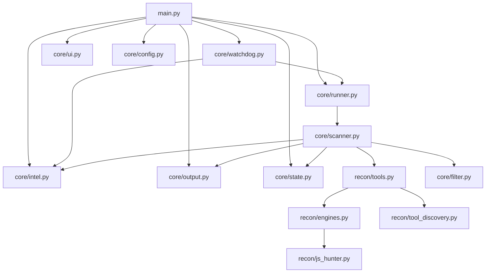

# Hunt3r v1.0-EXCALIBUR — Arquitetura Atual (Slim Core)

## 1) Arquitetura consolidada (estado atual)

## 2) Estrutura essencial de arquivos (ativa)

| Arquivo alvo | Origem consolidada | Responsabilidade final |
|---|---|---|
| `main.py` | `main.py` | CLI, roteamento de modo |
| `core/runner.py` | `core/scanner.py` + parte de `core/watchdog.py` | Orquestração única (manual + watchdog) |
| `core/ui.py` | `core/ui.py` | Interface terminal |
| `core/config.py` | `core/config.py` | Configuração única |
| `core/intel.py` | `core/ai.py` + `core/bounty_scorer.py` | IA/score/validação centralizados |
| `core/state.py` | `core/storage.py` | baseline + checkpoint |
| `core/output.py` | `core/notifier.py` + `core/reporter.py` + `core/export.py` | notificação + relatório + export |
| `recon/tools.py` | `recon/engines.py` + `recon/tool_discovery.py` | wrappers e descoberta de binários |

## 3) Resultado da consolidação

- Interfaces unificadas em produção (`runner/state/output/intel/tools`).
- Pipeline com contratos explícitos por fase (`ok/errors/counts/paths`).
- Watchdog adaptativo com métricas operacionais por ciclo.
- Deduplicação temporal de notificações para reduzir ruído.
