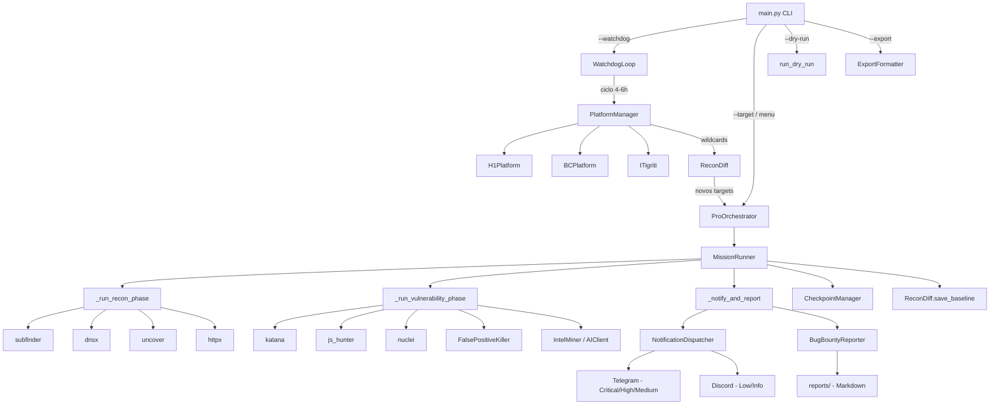

# Hunt3r v1.0-EXCALIBUR — Architecture Diagram

## Módulos ativos (16 arquivos Python)

| Módulo | Linhas | Responsabilidade |
|--------|--------|-----------------|
| `core/config.py` | ~185 | Constantes, timeouts, rate limiter, dedup, validação |
| `core/ai.py` | ~240 | AIClient (OpenRouter) + IntelMiner |
| `core/storage.py` | ~165 | ReconDiff + CheckpointManager |
| `core/export.py` | ~160 | ExportFormatter CSV/XLSX/XML + run_dry_run |
| `core/ui.py` | ~395 | Terminal UI, live view, threading.RLock |
| `core/filter.py` | ~120 | FalsePositiveKiller (6 filtros) |
| `core/scanner.py` | ~320 | MissionRunner + ProOrchestrator |
| `core/notifier.py` | ~280 | NotificationDispatcher Telegram + Discord |
| `core/reporter.py` | ~200 | BugBountyReporter → Markdown |
| `core/watchdog.py` | ~260 | Loop 24/7 autônomo |
| `core/updater.py` | ~180 | PDTM + nuclei-templates |
| `recon/engines.py` | ~200 | Wrappers 6 ferramentas PD |
| `recon/js_hunter.py` | ~160 | Extração real JS secrets |
| `recon/platforms.py` | ~243 | APIs H1/BC/IT |
| `recon/tool_discovery.py` | ~57 | find_tool() com cache |
| `main.py` | ~281 | Entry point CLI |

**Total**: ~3600 linhas em 16 arquivos Python ativos.
